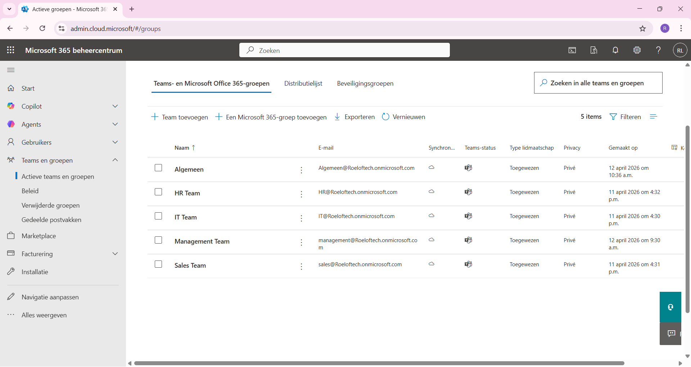
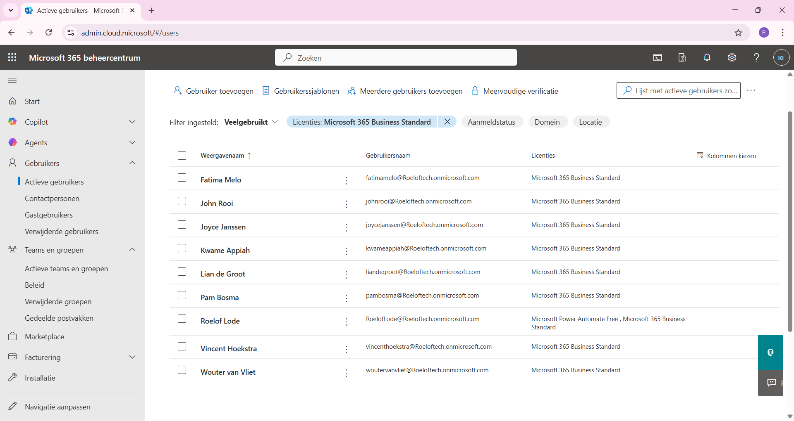
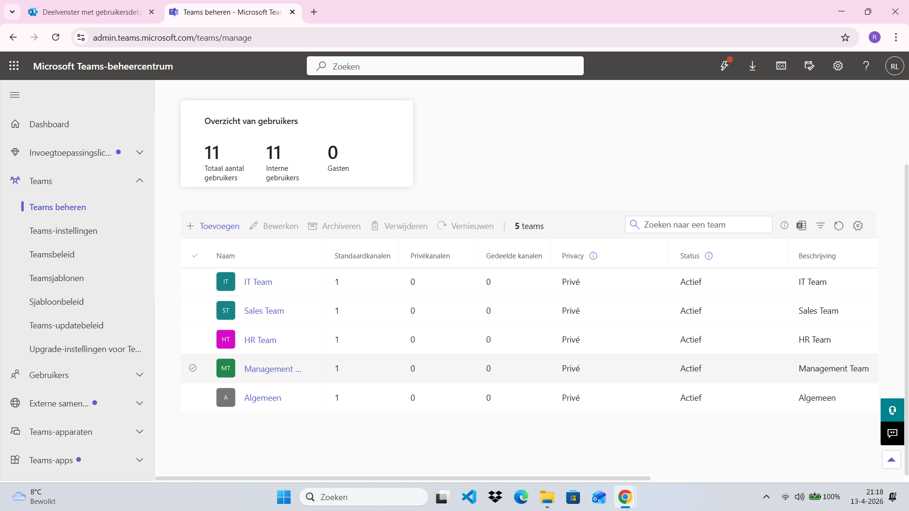

# Microsoft 365 Tenant Admin Project

In this project, I set up a Microsoft 365 demo environment to practice basic administration tasks.

I created and managed users, assigned licenses, and configured different departments such as HR, IT, Sales, and Management. These departments were organized using Microsoft 365 groups and connected to Microsoft Teams, Sharepoint and Exchange.

This project demonstrates my understanding of:
- User management
- License assignment
- Group and team configuration
- Basic Microsoft 365 administration

The screenshots show the configuration and structure of the environment.

## Images

#### Microsoft 365 Admin Center Groups

#### Microsoft 365 Admin Center Users

#### Teams Admin Center

#### Teams Members

